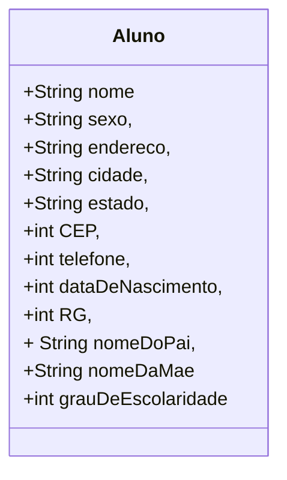

# cadastro-de-alunos
Aplicativo de cadastro de alunos como exercício nas aulas de desenvolvimento de sistemas do Senac

## Fase 1 Cap. 2

Iniciando a proposta, que é construir um sistema de informação, declare as variáveis para o algoritmo de cadastramento de alunos, cujos dados são:

- nome,
- sexo,
- endereço,
- cidade,
- estado,
- CEP,
- telefone,
- data de nascimento,
- RG,
- nome do pai,
- nome da mãe
- grau de escolaridade

Classifique os dados segundo os tipos das variáveis (numéricos, literais ou lógicos) que irão armazená-los.

- Variáveis literais:	nome do aluno, sexo, endereço, cidade, estado,	nome do pai, nome da mãe.
- Variáveis numéricas:	telefone, CEP, RG, data de nascimento, grau de 	escolaridade....

## Diagrama de classe:



## Fase2 cap. 4

Atribuição de valores às variáveis:

O usuário entra com valores pra preencher as variáveis:

```
		leia “Entre com o sexo:”, SEXO
		leia “Entre com o endereço:”, ENDERECO
		leia “Entre com a cidade onde o aluno reside:”, CIDADE
		leia “Entre com a sigla do estado onde o aluno reside:”, UF
		leia “Entre com o CEP (somente números):”, CEP
		leia “Entre com o telefone (somente números):”, FONE
		leia “Entre com o nome do pai do aluno:”, PAI
		leia “Entre com o nome da mãe do aluno:”, MAE
		leia “Entre com o Registro Geral (RG) do aluno (somente números)
		leia “Entre com o grau de escolaridade do aluno (0, 1, 2, 3):”, GRAUESC
		escreva “Aluno:”, NOME
		escreva “Sexo:”, SEXO, “Data de Nascimento:”, DATANASC
		escreva “Registro Geral (RG):”, RG
		escreva “Grau de escolaridade:”, GRAUESC, “grau”
		escreva “Endereço:”, ENDERECO, “Cidade:”, CIDADE, “Estado:”, UF
		escreva “CEP:”, CEP
		escreva “Telefone:”, FONE
		escreva “Nome do pai:”, PAI
		escreva “Nome da mãe:”, MAE
```

Cadastrar 50 alunos significa repetir o algoritmo anterior cinquenta vezes, ou seja, utilizar uma estrutura de repetição; neste caso, utilize a estrutura para/faça/fim-para. Para controlar a quantidade de alunos cadastrados, você deve utilizar uma variável contadora. Antes disso, porém, todas as variáveis do algoritmo devem ser declaradas.


## Referência

Xavier, Gley Fabiano Cardoso
Lógica de programação
E-book. Disponível em: https://bibliotecadigitalsenac.com.br/?from=%3FcontentInfo%3D1306#/legacy/epub/1306
Acesso em 15/05/2023

[Editor de diagramas Mermaid](https://mermaid.live/)
