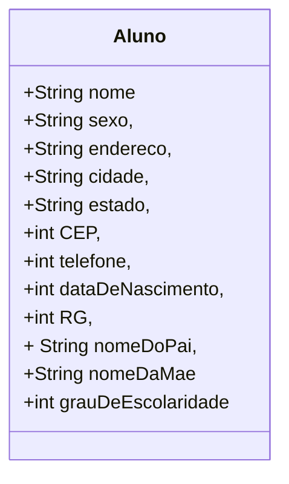

# cadastro-de-alunos

Aplicativo de cadastro de alunos como exercício nas aulas de desenvolvimento de sistemas do Senac

## Fase 1 Cap. 2

Iniciando a proposta, que é construir um sistema de informação, declare as variáveis para o algoritmo de cadastramento de alunos, cujos dados são:

- nome,
- sexo,
- endereço,
- cidade,
- estado,
- CEP,
- telefone,
- data de nascimento,
- RG,
- nome do pai,
- nome da mãe
- grau de escolaridade

Classifique os dados segundo os tipos das variáveis (numéricos, literais ou lógicos) que irão armazená-los.

- Variáveis literais: nome do aluno, sexo, endereço, cidade, estado,	nome do pai, nome da mãe.
- Variáveis numéricas: telefone, CEP, RG, data de nascimento, grau de 	escolaridade....

## Diagrama de classe



Implementação em java:

```java
public class aluno {
    public String nome, sexo, endereco, cidade,
            estado, nomeDoPai,nomeDaMae ;
    public int cep, rg, grauDeEscolaridade, telefone, dataDeNascimento;    
    
}
```

## Referência

Xavier, Gley Fabiano Cardoso
Lógica de programação
E-book. Disponível em: https://bibliotecadigitalsenac.com.br/?from=%3FcontentInfo%3D1306#/legacy/epub/1306
Acesso em 15/05/2023

[Editor de diagramas Mermaid](https://mermaid.live/)

[README principal](../README.md)
