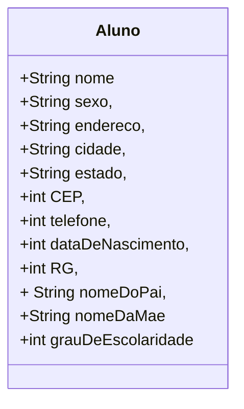

# cadastro-de-alunos

Aplicativo de cadastro de alunos como exercício nas aulas de desenvolvimento de sistemas do Senac

## Fase 5

Adicionar uma função no código que permitirá salvar os dados dos alunos em um arquivo de texto.

## Diagrama de classe

## Referência

Xavier, Gley Fabiano Cardoso
Lógica de programação
E-book. Disponível em: https://bibliotecadigitalsenac.com.br/?from=%3FcontentInfo%3D1306#/legacy/epub/1306
Acesso em 15/05/2023

[Editor de diagramas Mermaid](https://mermaid.live/)

[README principal](../README.md)
